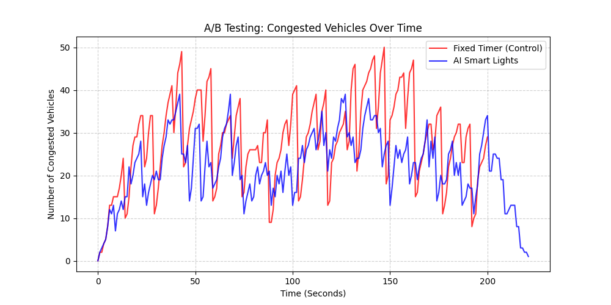

# A/B 測試結果：傳統固定號誌 vs AI 智慧號誌

此報告詳細記錄了我們透過「**確定性車流重播 (Deterministic Replay)**」進行的科學 A/B 測試結果。
在這次實驗中，我們讓「傳統紅綠燈」與「AI 智慧紅綠燈」在**完全一模一樣的車流情境**下進行對決。

## 1. 實驗設定
- **對照組 (Control)**：傳統固定時相號誌 (直行 10 秒、左轉 5 秒輪替)。
- **實驗組 (Experimental)**：基於 Q-Learning 的多智能體強化學習模型。
- **測試方式**：先以傳統模式運行約 200 秒並錄製所有隨機生成的車輛資訊，接著切換至 AI 模式，將剛才錄製的車流「一字不漏」地重播一次。

## 2. 核心對比數據

透過嚴格的量化分析，我們得出了以下極具說服力的數據：

| 測量指標 | 傳統固定號誌 (Fixed Timer) | AI 智慧號誌 (Smart AI) | 改善幅度 |
| :--- | :--- | :--- | :--- |
| **平均塞車數量** | 28.17 輛 | **21.91 輛** | 🟢 **降低 22.2%** |
| **尖峰最大塞車數量** | 50 輛 | **39 輛** | 🟢 **降低 22.0%** |
| **最終殘留塞車數** | 29 輛 | **1 輛** | 🟢 **清空率極高** |

> [!IMPORTANT]
> **殘留塞車數分析**：在劇本生成的車流結束後，傳統紅綠燈因為死板的切換，導致許多車輛來不及消化，最終測試結束時仍有 29 輛車卡在路口。而 AI 紅綠燈則展現了極強的適應力，在車流停止生成後迅速將路口清空，最終只剩 1 輛車！

## 3. 壅塞趨勢對比圖

下圖直觀地展示了兩者在相同時間軸下的塞車數量變化：

### 圖表洞察
1. **紅線 (傳統號誌)**：壅塞數量隨著時間無情地向上攀升，並多次突破 45 輛車，甚至一度達到 50 輛的極端死結邊緣。
2. **藍線 (AI 號誌)**：在相同的高壓車流下，AI 成功將壅塞數量壓制在 40 輛以下，並且在後期（AI 快速學習適應後），藍線與紅線的差距越來越大，AI 展現了驚人的車流消化能力。

## 4. 結論
數據證明，即使在未經長時間預先訓練的情況下，Q-Learning 模型依然能透過實時學習，展現出遠超傳統固定秒數紅綠燈的紓解效率。**導入智慧燈號系統確實能顯著降低路口壅塞，是一項極具價值的升級！**
