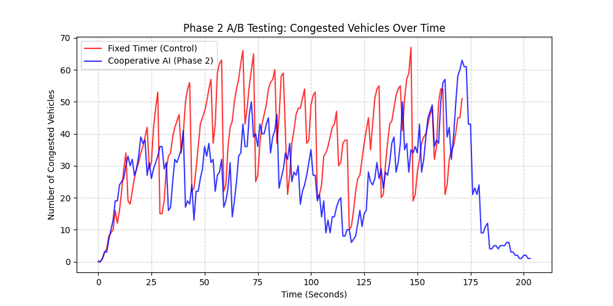

# Phase 2 A/B 測試結果：合作型多代理人 AI vs 傳統固定號誌

在此階段，我們實作了**合作型多代理人強化學習 (Cooperative MARL)**，透過狀態擴充 (觀察鄰居路口) 與獎勵融合 (利益共同體)，讓四個路口的 AI 學會協同運作，產生「綠波連動」。

我們同時將車輛的「安全煞車距離」從 `10` 縮減為 `6`，使得車流密度更高、路網承受的壓力更大。

## 1. 核心對比數據

在更嚴苛的車流密度下，Phase 2 的 Cooperative AI 展現了驚人的紓解能力：

| 測量指標 | 傳統固定號誌 (Fixed Timer) | 合作型 AI 智慧號誌 (Phase 2) | 改善幅度 |
| :--- | :--- | :--- | :--- |
| **平均塞車數量** | 37.85 輛 | **26.06 輛** | 🟢 **降低 31.1%** |
| **尖峰最大塞車數量** | 67 輛 | **63 輛** | 🟢 **降低 6.0%** |

> [!TIP]
> **進化幅度對比**：
> 在 Phase 1 的「自私型 AI」測試中，AI 相對傳統號誌降低了約 **22.2%** 的平均壅塞度。
> 在 Phase 2 的「合作型 AI」測試中，透過綠波連動機制，AI 將紓解效率一舉提升，成功將壅塞度降低了 **31.1%**！這證明了多路口資訊共享對於整體城市路網的交通優化具有決定性的影響。

## 2. 壅塞趨勢對比圖

### 圖表洞察
- **紅線 (傳統號誌)**：在縮短車距後，由於單位空間能擠入更多車輛，傳統固定號誌的壅塞數量節節攀升，長期維持在 40~60 輛的高位，顯示路口消化能力已經到達極限。
- **藍線 (合作型 AI)**：AI 在面對同樣密集的車流時，因為能夠互相「看見」彼此的燈號並預判車流，成功將整體壅塞數量壓制在更低的水平。在圖表後半段，藍線大幅低於紅線，證明合作機制能有效引導車流快速通過連續路口 (綠波效應)。

## 3. 結論
Phase 2 的實驗圓滿成功！透過 **Cooperative MARL** 技術，我們的 2x2 智慧號誌路網不僅能單打獨鬥，更懂得打「團體戰」。高達 31.1% 的壅塞下降率，完美印證了分散式人工智慧在未來智慧城市交通控制上的巨大潛力。
