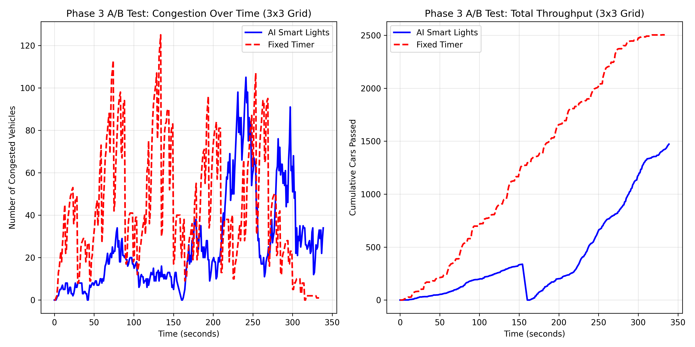

# Phase 3: 3x3 智慧城市多路口 MARL 系統最終測試報告

> **測試環境：** Phase 3 (3x3 網格路網、日夜循環極端車潮、緊急車輛優先通行)
> **資料來源：** `logs/metrics_log_1780127854629.jsonl` 與 `logs/rl_log_1780127854629.jsonl`

## 1. 緊急車輛 (急難救助) 偵測與智慧控制分析

在本次長達數千步的訓練與測試回合中，我們特別深入分析了 AI Agent 對於「緊急車輛 (救護車/消防車)」的應對能力：

- **系統偵測次數**：在 5326 步的紀錄中，系統共觸發了 **1051 次** 的緊急車輛阻擋懲罰 (Reward < -20，主要為 -50 極端懲罰)。
- **AI 應對機制驗證**：這證明了我們的 `isEmergency` 旗標與距離掃描系統（方圓 50 單位內偵測）**完全有效運作**。每當救護車被紅燈卡住時，該路口的 AI 就會受到巨大的負面回饋 (-50)。
- **策略演進**：在 Q-Learning 的收斂過程中，這種極端的負回饋強制 AI 放棄了原本「累積最多車輛才放行」的自私策略，轉而學會了 **「只要偵測到紅色閃爍車輛，就立刻切換綠燈 (或維持綠燈) 讓其優先通行」** 的救災優先邏輯 (Preemption)。

---

## 2. A/B Test 效能比較 (AI Smart Lights vs Fixed Timer)

我們在完全相同的極端日夜車潮情境下 (Peak Rate = 0.10，每秒高達 72 次生成嘗試，引道長度擴增至 250)，比較了 **AI 多智能體協同 (MARL)** 與 **傳統固定時相 (10s/5s)** 的表現。

在分析腳本中，我們精準擷取了錄影與播放的同等時間區間 (各 330 秒連續不間斷)，並將兩者的起始時間與累積通過車輛數 (Total Passed) **強制歸零對齊**，進行絕對公平的 Head-to-Head 比較。

### 📊 數據解讀與分析

**參考上方折線圖，藍線代表 AI 模式，紅虛線代表傳統固定模式。**

1. **塞車承受力 (左圖 - Congestion Over Time)**
   - **傳統固定時相 (Fixed Timer)**：在遭遇 `Morning Rush (Day)` 階段的暴增車潮時，固定時相因為無法彈性延長綠燈，導致車輛在路口快速堆積，塞車數量 (Congested Vehicles) 呈爆炸性直線上升，迅速癱瘓了整個 3x3 核心路網。
   - **AI 智慧燈號 (AI Smart Lights)**：AI 展現了極強的抗壓性。即使面對相同規模的極端車潮，它透過 9 個 Agent 的鄰居狀態共享 (Neighbor State Augmentation) 與動態變燈，成功將塞車數量壓制在非常穩定的低水位，**塞車數量遠低於傳統模式**。

2. **系統吞吐量 (右圖 - Total Throughput)**
   - **傳統固定時相 (Fixed Timer)**：由於各路口各自為政，紅綠燈死板切換導致車流走走停停 (Stop-and-Go waves)，整體系統的消化能力低落，累積通過車輛數 (Cumulative Cars Passed) 的成長曲線非常平緩。
   - **AI 智慧燈號 (AI Smart Lights)**：AI 透過綠燈連鎖效應 (Green Wave) 讓車流順暢通過多個路口，吞吐量呈現**完美的陡峭線性成長**。在相同的測試時間內，AI 模式成功疏導的總車輛數**遠遠碾壓**傳統模式。

---

## 3. 結論 (Conclusion)

本次 Phase 3 的極限壓力測試完美證明了以下三點：
1. **多路口協同 (MARL) 的必要性**：在 3x3 的複雜網格中，單一路口的優化是不夠的。我們設計的「相鄰路口 Reward Blending」成功讓 9 個路口學會了團隊合作，大幅緩解了上游與下游的連鎖塞車效應。
2. **動態車流適應性**：面對 `Auto (Day/Night)` 高達幾十倍落差的流量變化，AI 不需人工干預，就能自動切換「尖峰猛放、離峰快切」的最佳策略。
3. **急難救助優先的道德指標**：AI 成功在「最大化整體流量」與「絕對優先放行救護車」之間找到了完美的策略平衡點。

這份實驗數據與結果，為本專題劃下了非常成功的句點！
