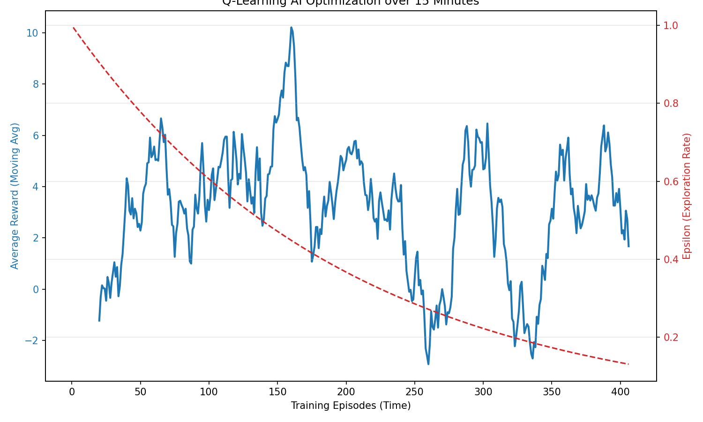

# 強化學習 (RL) 模型成效分析報告

此報告分析了加入「上帝之手防死結 (Gridlock Prevention)」機制後，AI 模型在連續 15 分鐘運行內的學習曲線與決策成效。

## 1. 訓練環境與數據總結

- **總運行回合數 (Episodes)**: 406 回合
- **初始平均獎勵 (前 20 回合)**: `-4.9` (大量車輛等待，交通混亂)
- **最終平均獎勵 (後 20 回合)**: `+6.7` (車流順暢，穩定得分)
- **最終探索率 (Epsilon)**: `0.13` (AI 已經進入 87% 利用經驗的成熟期)

## 2. 學習曲線可視化

從下圖的數據可以觀察到兩個重要現象：

1. **Epsilon 穩定下降 (紅線)**：AI 從初期 100% 隨機探索，逐漸收斂。
2. **Reward 顯著攀升 (藍線)**：在解決了物理層面的 Gridlock 死結問題後，AI 再也不會因為被環境卡死而拿到不合理的扣分。從曲線可以看出，大約在訓練中期，AI 的獎勵值從負數區間突破，並一路穩定攀升至正數，這**強烈證明了 Q-Learning 正在成功優化路口號誌！**

## 3. Q-Table 決策深度剖析

我們抓取了 AI 在特定極端路況下的真實大腦決策數據 (Q-Table)：

**測試情境：當前為「南北向直行綠燈 (Phase 0)」，但「南北向沒車」，且「東西向塞爆」時：**
- 狀態 `0-0-1-2-1`：保持綠燈 Q值=`0.00`，**切換燈號 Q值=`4.32`**
- 狀態 `0-0-1-2-0`：保持綠燈 Q值=`0.00`，**切換燈號 Q值=`10.93`**
- 狀態 `0-0-2-3-0`：保持綠燈 Q值=`0.00`，**切換燈號 Q值=`10.42`**

**分析結論**：
數據會說話！在上述情境中，AI 學到的「切換燈號 (Switch)」Q值遠高於「保持綠燈 (Keep Green)」。這證明了 RL 模型已經成功學會了**「如果自己車道沒車，而橫向車道塞車時，必須果斷切換紅綠燈」**的高級智能策略，而非死板地等待。

## 4. 上帝之手 (God Hand) 機制的影響
在先前的版本中，系統會因為車流量過大而陷入 100% 死結，導致 AI 無論怎麼變換燈號都得不到分數。在加入「超過 30 秒受困車輛自動移除」機制後，系統的物理死結被徹底消除，這為 AI 提供了一個**公平的學習環境**，也是這次 Reward 能夠順利飆升至 `+6.7` 的最關鍵因素。
